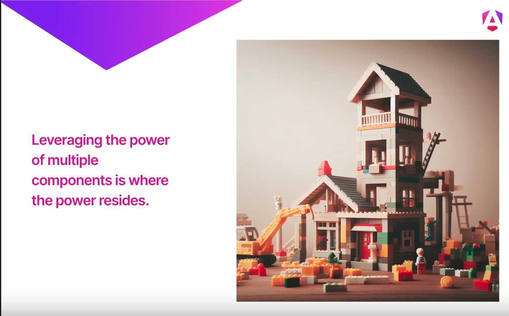

> Angular is a web framework used to be build scalable web apps with confidence.

## Creating a Component

```ts
import {Component} from '@angular/core';

@Component({
    selector: 'app-root',   
    standalone : true,
    template : `<h1>Hey , Frontend Masters!</h1>`,
    style : `h1 { color : red}`
})

class AppComponent { }
```

## Component Composition

A single component is like block.


